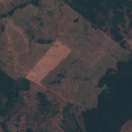
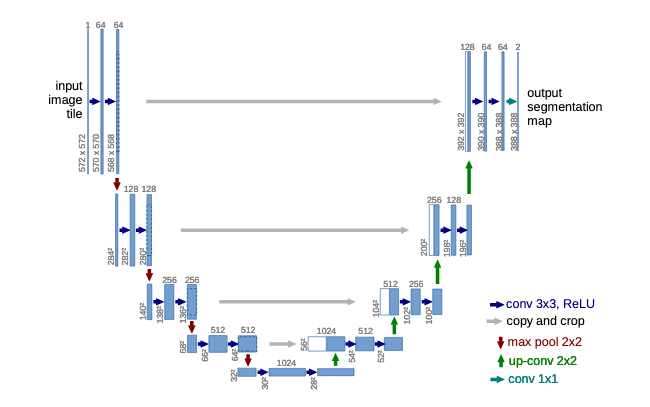

# Forest_Image_Segmentation

#Overview: semantic segmentation of forest and non-forest areas with U-Net 
#Dataset: https://zenodo.org/record/3233081#.YD-OGGPLfq0 
#input

</img> 
#ground truth

</img> 

#prediction

</img> 

#unet

</img> 
